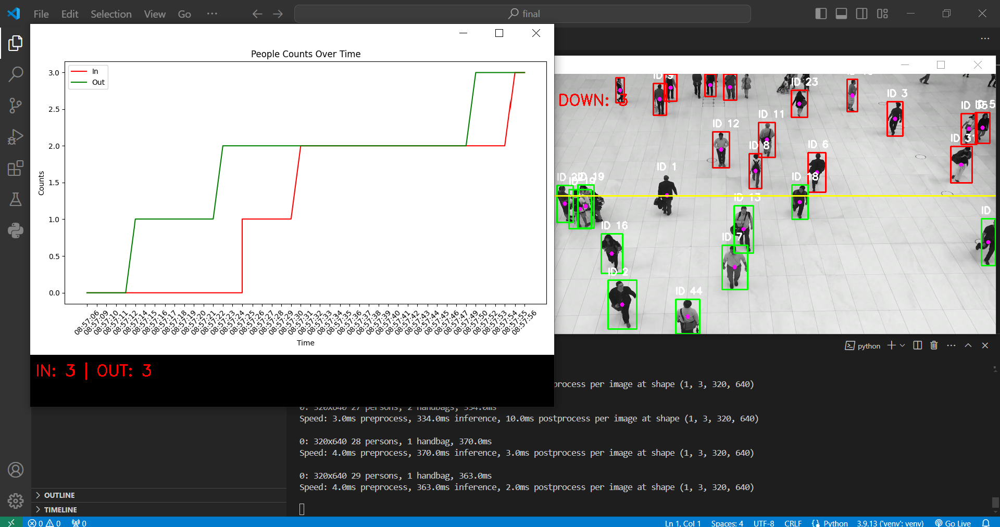

# Features
- Real-time People Detection and Tracking: Uses YOLOv8 for accurate detection of people in video frames.
- Custom Line Drawing for Counting: Allows the user to draw a custom line in the video feed to define the area for - - counting people by clicking and dragging with the mouse.
- Up/Down Counter: Tracks the number of people crossing the defined line in both directions.
- MongoDB Integration: Stores the counting data with timestamps in a MongoDB database.
- Statistics Visualization: Plots and displays the counts over time using Matplotlib.


# DEMO Images
 

# Installation
1. Clone the repository:
```
git clone https://github.com/sial-sanwal/People-Tracking-and-Counting-with-YOLOv8-and-MongoDB
```
2. Install the required Python packages:
```
pip install -r requirements.txt
```
3. Update the MongoDB connection string in the script:
```
connection_string = "your_mongodb_connection_string"
```
# Usage
1. Prepare a video file (videoclip.mp4) and place it in the project directory.
2. Run the main script:
```
python main.py
```
3. Draw a custom line in the video window by clicking and dragging with the mouse. The system will start counting people crossing the line.

# Directory Structure
```
people-tracking-yolov8/
├── coco.txt                # Class names for YOLO
├── main.py                 # Main script for running the project
├── requirements.txt        # Python dependencies
├── tracker.py              # Custom tracker module
├── videoclip.mp4           # Sample video file
└── README.md               # Project documentation
```


